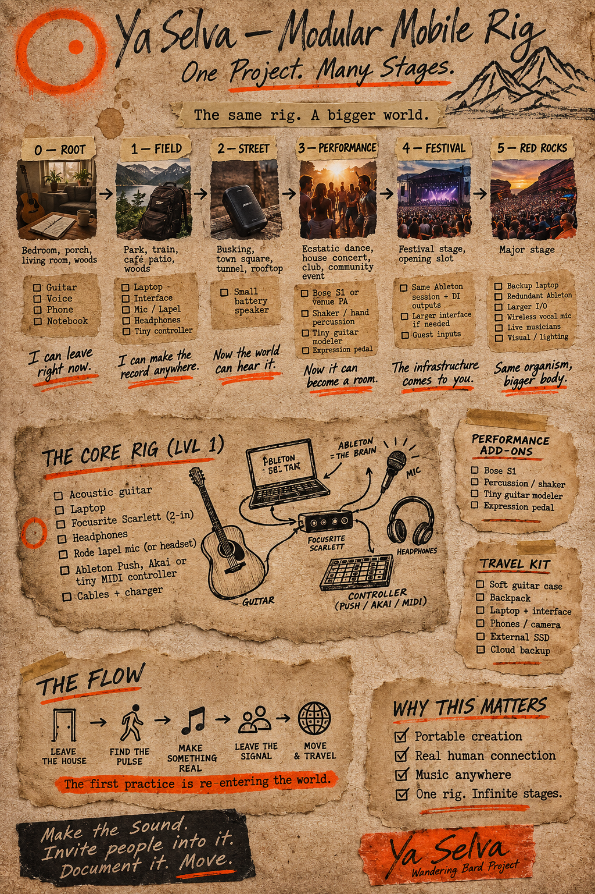
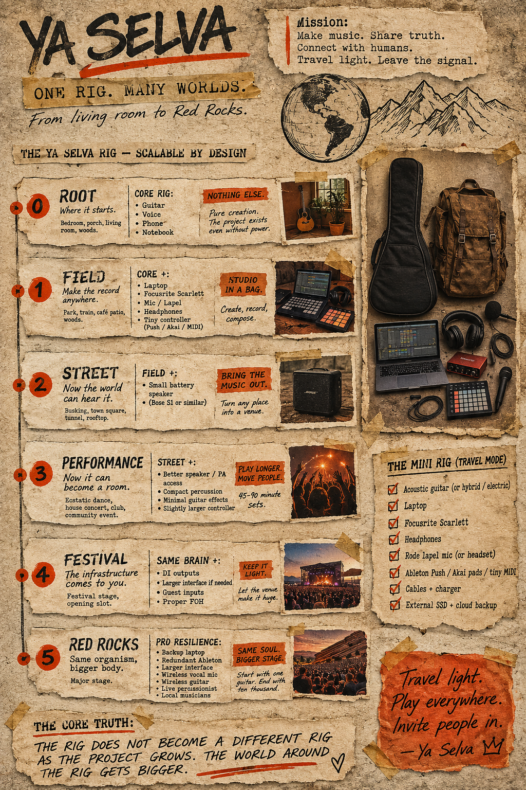

# The rig

**One rig. Many worlds. From living room to Red Rocks.**

The Ya Selva rig is modular by design. The core setup never changes — the
world around it just gets bigger. Start with a guitar and a notebook in a
bedroom; end with the same Ableton session on a festival stage. The rig does
not become a different rig as the project grows. The world around the rig
gets bigger.

## The core rig (Level 1)

- Acoustic guitar
- Laptop
- Focusrite Scarlett (2-in)
- Headphones
- Rode lapel mic (or headset)
- Ableton Push, Akai, or tiny MIDI controller
- Cables + charger

Ableton is the brain. Guitar and mic feed the Scarlett; the Scarlett feeds
the laptop; the controller plays it back out.

## The six tiers

| tier | where | adds | unlocks |
|---|---|---|---|
| **0 — Root** | Bedroom, porch, living room, woods | Guitar, voice, phone, notebook | I can leave right now. |
| **1 — Field** | Park, train, café patio, woods | Laptop, interface, mic/lapel, headphones, tiny controller | I can make the record anywhere. |
| **2 — Street** | Busking, town square, tunnel, rooftop | Small battery speaker (Bose S1 or similar) | Now the world can hear it. |
| **3 — Performance** | Ecstatic dance, house concert, club, community event | Same session + DI outputs, larger interface if needed, guest inputs | Now it can become a room. |
| **4 — Festival** | Festival stage, opening slot | DI outputs, larger interface, guest inputs, proper FOH | The infrastructure comes to you. |
| **5 — Red Rocks** | Major stage | Backup laptop, redundant Ableton, larger I/O, wireless vocal mic, live musicians, visual/lighting | Same organism, bigger body. |

## Mini rig (travel mode)

- Acoustic guitar (or hybrid/electric)
- Laptop
- Focusrite Scarlett
- Headphones
- Rode lapel mic (or headset)
- Ableton Push / Akai pads / tiny MIDI
- Cables + charger
- External SSD + cloud backup

## The flow

Leave the house → find the pulse → make something real → leave the signal →
move & travel.

**The first practice is re-entering the world.**

## The core truth

The rig does not become a different rig as the project grows. The world
around the rig gets bigger.

Travel light. Play everywhere. Invite people in.
