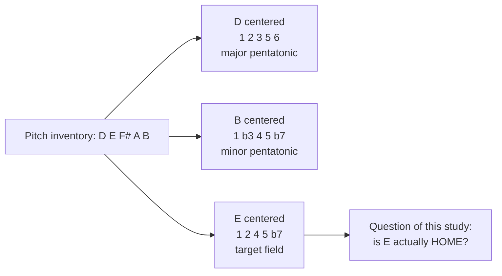
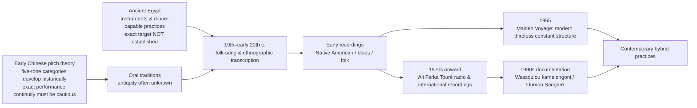

# Pentatonic Field Research — 1–2–4–5–♭7

**External research. Filed 2026-09-01.**

| | |
|---|---|
| **what** | Deep-research report on the 1–2–4–5–♭7 pentatonic field across traditions |
| **who made it** | ChatGPT Deep Research — **not** written by Adam, not written in-house |
| **why it exists** | To test whether the thirdless E–F♯–A–B–D field has real historical precedent |
| **status** | **Raw. Unedited. Claims not independently verified.** |
| **also filed as** | `docs/13-pentatonic-field-research.pdf` — the original PDF, unmodified |

## Why it's here

The musical question underneath Ya Selva: can a five-note field with no third —
1–2–4–5–♭7, or E–F♯–A–B–D — carry real tonal gravity, and is that an inherited
tradition or an invention?

**The report's answer, compressed:**

```
DOCUMENTED       the exact field with 1 genuinely at home — Wassoulou kamalengoni,
                 Carnatic Madhyamāvati, Chinese shāng mode, "Maiden Voyage"
WIDESPREAD       tonic gravity without a third — drone, final, fifth, cyclic bass
BLUES            the flexible third as expressive color, not fixed scale degree
NOT SUPPORTED    any single global genealogy tying these together
```

Its most useful finding for the project is the separation it draws: **tonic certainty
and major/minor certainty are independent parameters.** Root and fifth can be absolute
while the third stays undefined.

Two things it explicitly refuses to support, worth knowing before quoting it anywhere:

- **"Egyptian pentatonic" is not historically defensible** as a name for this scale.
  The report recommends "anhemitonic pentatonic 1–2–4–5–♭7," "suspended pentatonic,"
  or the tradition's own name where one exists.
- The **E→A fourth move** as an indigenous norm has no strong historical source. The
  report calls it creative extrapolation built from documented behaviors — legitimate
  compositionally, not historically.

It grades its own claims **Level A / B / C** (direct evidence / strong inference /
suggestive analogy). Those grades are the most useful thing in it — read them.

## How to read it

- **This is a source, not a decision.** Nothing here is adopted into Ya Selva canon.
- The report is unusually careful about the difference between *the same five pitches
  occur* and *the same note is home*. That distinction is the whole study.
- The `citeturn…` strings are ChatGPT's internal citation tokens — artifacts of
  the export, not links. Left in place so the document stays as delivered.

**Everything below this line is the report exactly as delivered. Unedited.**

---

# The Global History and Musical Function of the Pentatonic Field 1–2–4–5–♭7

## Executive summary

The central finding is clear: **1–2–4–5–♭7 is not merely a theoretical rotation of major/minor pentatonicism. There are documented musical systems in which the first pitch genuinely functions as a center, final, or tonic while the permanent five-note inventory is structurally equivalent to 1–2–4–5–♭7.** The strongest cases found in this investigation are unusually diverse: southern Malian/Wassoulou kamalengoni practice; South Indian Carnatic rāga **Madhyamāvati**; Chinese **shāng**-mode theory and documented repertoire; and, in a very different modern context, the suspended/quartal fields of Herbie Hancock's “Maiden Voyage.” These cases should **not** be treated as evidence of common ancestry. They are better understood, except where transmission is documented, as independent realizations of a simple but powerful tonal possibility. citeturn7view0turn15search4turn27search0turn26search8

The single strongest ethnomusicological example is Lucy Durán's documentation of the **kamalengoni** of Wassoulou. She gives the instrument's five pitch classes as **D–E–G–A–C** and states that much of its repertory is based on the lowest right-hand string, the **bajourouba**, with songs **beginning and ending on that string**. In the tuning she transcribes, that string is D. Thus the evidence is not simply “these are the notes of C major pentatonic”: the documented center is D, giving **D–E–G–A–C = 1–2–4–5–♭7**. This satisfies the present study's unusually strict tonal-center criterion at Evidence Level A. citeturn7view0

A second exceptionally strong case is Carnatic **Madhyamāvati**. Its conventional pitch grammar is **S–R₂–M₁–P–N₂–S** ascending and descending. With Sa placed on E, a Western pitch-class approximation is **E–F♯–A–B–D–E**: exactly the requested field. Unlike a scale-dictionary rotation, **Sa is definitionally the tonic reference of the rāga system**, and Indian classical performance normally reinforces Sa, frequently together with Pa, through the tānpūrā/tambura drone. Madhyamāvati therefore provides perhaps the clearest answer to the question “can 1 and 5 alone give extremely strong gravity while the third is absent?” The answer is emphatically yes. The important caveat is that Carnatic svaras are not best understood as fixed equal-tempered piano notes, and Madhyamāvati is a **rāga**, not merely a scale. citeturn27search0turn27search3turn27search7turn27search15

Chinese pentatonic theory provides another genuine tonal-center precedent. Taking the familiar five-tone collection C–D–E–G–A, establishment of **shāng** as the principal/final pitch produces **D–E–G–A–C**, exactly 1–2–4–5–♭7 from D. Modern Chinese modal theory explicitly distinguishes collections that share pitches but establish different principal or final tones; a Smithsonian Folkways liner source identifies a Sichuan mountain song specifically as a five-tone **Shang mode, D–E–G–A–C**. This is much stronger evidence than simply rotating a Western scale after the fact, although historical Chinese modal terminology and regional systems should not be collapsed into a single timeless “Chinese pentatonic scale.” citeturn15search4turn15search20turn15search12

The label **“Egyptian pentatonic” is not historically defensible as a name for an ancient Egyptian pitch system on present evidence**. Contemporary scale dictionaries and guitar-oriented theory sources use “Egyptian” and “suspended pentatonic” for 1–2–4–5–♭7, but authoritative Egyptological literature does not establish this scale as an indigenous ancient Egyptian theoretical category. Indeed, some older attempts—especially Hans Hickmann's efforts to infer intervals from Egyptian chironomy—are now treated cautiously or questioned, and no deciphered indigenous Egyptian pitch notation establishes this specific five-note system. The responsible terminology is therefore **“anhemitonic pentatonic 1–2–4–5–♭7,” “suspended pentatonic” when speaking modern Western theory, or the tradition-specific name where one actually exists**. citeturn9search7turn11view0turn10search4

The broader hypothesis divides into two claims, and the evidence for them is unequal. **Thirdless tonal infrastructure is historically and geographically substantial.** Drone, final, registral emphasis, repeated fundamentals, fifths, cyclic bass patterns, and recurring melodic nuclei can all create strong tonal gravity without a major or minor triad. Wassoulou, Madhyamāvati, Indian drone practice, certain African guitar practices, suspended jazz harmony, and many drone traditions support that conclusion. citeturn7view0turn27search7turn20search9turn26search16

The narrower idea that the **third is habitually withheld from the infrastructure but subsequently introduced as a flexible major/minor/neutral expressive color** is much more strongly documented in the African-American blues continuum than in the exact-target traditions. Scholarship on Robert Johnson and blues intonation documents thirds that can occupy minor, neutral, or variable regions rather than behave as a single equal-tempered harmonic scale degree. By contrast, in Madhyamāvati the third is structurally absent; inserting one freely would normally compromise rāga identity rather than constitute standard Madhyamāvati practice. Likewise, Durán's Wassoulou evidence proves an instrument field without the third, but does not prove a tradition of continuously bending a melodic third over that exact field. The proposed combination—**Madhyamāvati/Wassoulou-like thirdless infrastructure plus blues-like flexible third color**—is therefore best understood as a compelling **modern synthesis of separately documented practices**, not a universally inherited ancient system. citeturn2search2turn2search3turn7view0turn27search0

The requested fourth-related move, E→A, produced a similarly nuanced result. **Model A**, keeping E–F♯–A–B–D fixed while changing perceptual center, has genuine precedents in pentatonic modal reinterpretation; most strikingly, Oumou Sangaré's “Diarabi/Diaraby Nene” is explicitly described by Durán as beginning on the Wassoulou bajourouba center and later shifting to another center while preserving the kamalengoni pitch inventory. But her documented shift is D→C, not D→G. **Model B**, transposing the entire thirdless formula with its local root, has an unusually clean modern precedent in the suspended fields of “Maiden Voyage,” where D–E–G–A–C over D is moved to F–G–B♭–C–E♭ over F and comparable structures elsewhere. I found no equally strong historical source documenting the exact sequence **E–F♯–A–B–D → A–B–D–E–G** as an indigenous I→IV norm. That specific device remains principally a creative extrapolation from real historical behaviors. citeturn7view0turn26search8turn26search16

Finally, the evidence for **circular rather than destination-driven musical development** is overwhelming, but it should not be confused with evidence for the exact five-note scale. Aka/BaAka polyphony, Wassoulou ostinato practice, Malian guitar, blues vamps, many African-American work-song procedures, and later minimal/modal practice all show ways in which music develops through repetition, interlocking, rhythmic displacement, ornamentation, density and subtraction rather than through an accelerating sequence of harmonic functions. Aka music is particularly important here—and particularly poor evidence for the exact target pitch field, because research describes its pitch systems in terms that do not map cleanly onto twelve-tone equal-tempered 1–2–4–5–♭7. citeturn17search6turn17search0turn7view0turn20search9

**Bottom line:** the sound-world in the question is neither an invented scale-theory curiosity nor a single ancient cross-cultural tradition. It is a **modern synthesis whose individual components have substantial historical precedents**. The precise 1–2–4–5–♭7 tonic field is directly documented in several independent traditions; tonic/fifth gravity without thirds is much more widespread still; flexible-third color is particularly strong in blues; and cyclic development with little harmonic motion is extremely widespread. What is *not* supported is a single global genealogy tying these practices together. citeturn7view0turn27search0turn15search4turn2search2turn17search6

## Method, theoretical identity, and terminology

Throughout this report, **Evidence Level A** means direct evidence: an authoritative theoretical source, published transcription, documented instrumental tuning, explicit culture-bearer explanation, or primary musical source sufficiently clear to establish the relevant point. **Level B** means a strong inference from credible musical evidence where one crucial element—often exact tonic, complete pitch inventory, or indigenous conception—is incompletely documented. **Level C** means a suggestive analogy: the musical process is relevant, but it cannot be counted as proof of 1–2–4–5–♭7 with 1 as home.

Just as importantly, four different kinds of equivalence are kept separate:

| Category | What it means | What it does **not** prove |
|---|---|---|
| **Pitch-set equivalence** | The same five pitch classes occur. | That the same note is home. |
| **Tonal-center equivalence** | The same relative interval set occurs **and** the proposed 1 acts as final, drone, root or principal pitch. | That musicians conceptualize it with Western scale-degree names. |
| **Analytical reinterpretation** | A modern analyst can coherently hear or describe the music as 1–2–4–5–♭7. | That historical musicians used that category. |
| **Indigenous/theoretical conception** | A tradition's own theory or documented practice identifies its principal pitch and pitch grammar. | That its tuning, interval semantics or musical function is identical to Western equal temperament. |

Grove uses *pentatonic* broadly for scales, systems or styles characterized by five pitches or pitch classes; the present set is more specifically **anhemitonic**, because its cyclic step pattern is 2–3–2–3–2 semitones in twelve-tone notation and therefore contains no semitone between adjacent scale members. citeturn17search20

The structural relationship requested in the prompt is exact:

| Perceptual center | Same absolute pitches | Relative formula | Conventional Western shorthand |
|---|---|---:|---|
| **D** | D E F♯ A B | 1 2 3 5 6 | D major pentatonic |
| **B** | B D E F♯ A | 1 ♭3 4 5 ♭7 | B minor pentatonic |
| **E** | **E F♯ A B D** | **1 2 4 5 ♭7** | suspended/“Egyptian” pentatonic in modern dictionaries |

Thus the requested E field is literally the same pitch-class inventory as D major pentatonic and B minor pentatonic. **What changes is hierarchy.** The difference between these three hearings is not pitch content but which pitch is established by bass, final, repetition, drone, phrase structure, register or theory as home.



Modern scale-reference material commonly calls this rotation **“suspended pentatonic”** and sometimes **“Egyptian”**; these are useful search terms, but they are modern classificatory names rather than evidence of a historical Egyptian system. citeturn9search7

The ancient-Egyptian claim does not survive a high evidentiary threshold. Egyptological scholarship documents instruments and musical scenes, and descriptions of double pipes indicate that one pipe could sustain a tone against melody on the other—evidence that drone-like practice was possible—but the surviving sources do not establish E–F♯–A–B–D-type interval organization. Older chironomic reconstruction, particularly the idea that hand gestures encoded exact fourths, fifths and octaves, has been questioned, and Egyptian musicians apparently left no securely deciphered indigenous notation from which this five-note formula can be reconstructed. **Negative finding: the provenance of the modern scale-name “Egyptian” could not be traced to a reputable historical Egyptian source.** citeturn11view0turn10search4

The word **“mode”** is therefore safe only in controlled contexts. Mathematically, any five-note set has five rotations. Historically, however, “rotation” becomes a meaningful musical mode only if the new starting pitch actually acquires structural priority. Cecil Sharp and later folk-song analysts did classify anhemitonic pentatonic repertories into pentatonic “modes,” and Chinese theory genuinely distinguishes pentatonic modal centers. But Japanese theory may be better described through nuclear tones, Javanese music through *laras* and *pathet*, Indian music through rāga and Sa-reference, Wassoulou through instrument-string hierarchy and tonal centers, and Aka music through cyclic polyphonic systems rather than a Western mode table. citeturn19search0turn15search4turn25search18turn25search23turn7view0turn17search6

This methodological point is particularly visible in Native American documentation. Frances Densmore frequently speaks of “keynotes,” “five-toned scales,” major/minor classifications and “Gaelic” scale types, reflecting early twentieth-century comparative-musicological categories. Her transcriptions are invaluable primary records, but her analytical vocabulary is not automatically an indigenous theory of pitch organization. The Smithsonian itself notes the massive scale of her documentation, while later discussion recognizes the Western theoretical framework within which she worked. citeturn23search7turn23search1

## Cross-cultural evidence and detailed case studies

**Case study — Wassoulou kamalengoni: the strongest exact match. [DOCUMENTED FACT, A]**  
Durán's 1995 study gives a six-string arrangement consisting of two rows of three strings. The transcribed pitch material collectively yields **D–E–G–A–C–D**. Crucially, she writes that much of the repertory is based on the lowest right-hand string, called **bajourouba**, and explains what that means behaviorally: **songs begin and end on this string**. In the tuning diagram the bajourouba is D. That establishes a hierarchy D > E/G/A/C rather than merely a five-pitch inventory. citeturn7view0

The resulting field is:

```text
D   E   G   A   C   D
1   2   4   5   ♭7  1
```

**[ANALYTICAL INTERPRETATION]** The evidence satisfies several independent tonic tests at once: D is the low referential string; repertory is said to be “based” on it; phrases begin there; phrases return there. The fifth A is physically embedded in the tuning network, while neither F nor F♯—the minor or major third above D—belongs to the basic five-note kamalengoni collection. This is therefore not merely “C major pentatonic starting on D”; it is the functional phenomenon under investigation. citeturn7view0

**[DOCUMENTED FACT]** Durán also observes an important modernization. Wassoulou popular groups often harmonize the bajourouba scale on guitar or keyboard **“in a minor key.”** That means Western-style arrangement can introduce a minor third that is absent from the underlying kamalengoni pentatonic field. This is strong evidence for **thirdless instrumental infrastructure followed by later triadic reinterpretation**, although it is not evidence that traditional singers conceptualized the third as a freely variable “blue” color. citeturn7view0

The tuning also links Wassoulou practice to neighboring pentatonic instrumental cultures that Durán discusses among Bamanan/Bamana, Minyanka and Senufo musicians, but the exact tonal-center behavior should not be generalized to all those traditions without equivalent phrase-final or instrument-root evidence. citeturn4view0turn7view0

**Case study — Oumou Sangaré, “Diarabi/Diaraby Nene”: fixed field, moving center. [DOCUMENTED FACT, A]**  
Durán identifies an especially valuable tonal event in Oumou Sangaré's “Diarabi nene.” The song begins with **bajourouba as tonal center** and later shifts to **kumaba, C**, while operating within the kamalengoni pitch collection. Thus the initial field D–E–G–A–C behaves as 1–2–4–5–♭7 from D, whereas after the shift the same pitches around C become C–D–E–G–A = 1–2–3–5–6, or what Western theory calls major pentatonic. citeturn7view0

This is almost a laboratory demonstration of the distinction motivating the entire research project:

```text
FIXED PITCH SET:      C D E G A

D perceived as home: D E G A C = 1 2 4 5 ♭7
C perceived as home: C D E G A = 1 2 3 5 6
```

**[ANALYTICAL INTERPRETATION]** Oumou's example is a documented precedent for **Model A — fixed pitch field, changing center**. It is *not*, however, the requested D→G or E→A fourth shift. The historical fact is more specific and more interesting: Wassoulou musicians can change modal center without changing their instrumental inventory, demonstrating that tonal hierarchy is an independent musical variable rather than a property automatically determined by the pitch set. citeturn7view0

The arrangement also shows how cyclic architecture works in Wassoulou. Durán describes short bipartite instrumental themes called **ngonisin** that form a basis for instrumental elaboration/improvisation (*teremeli*), in dialogue with solo/chorus procedures. Musical development therefore does not require a long harmonic progression; a compact harmonic-pitch framework is made productive by recurrence, variation and interaction. citeturn7view0

An official World Circuit stream of “Diaraby Nene” is available [here](https://www.youtube.com/watch?v=j-U7oLj8r18); World Circuit describes Sangaré's breakthrough repertory as drawing on Wassoulou musical traditions while adapting them to an urban popular setting. citeturn8search10turn8search3

**Case study — Carnatic Madhyamāvati: an indigenous theoretical exact match. [DOCUMENTED FACT, A]**  
The standard rāga specification is:

```text
Ārohaṇa:    S  R₂ M₁ P  N₂ S
Avarohaṇa:  S  N₂ P  M₁ R₂ S
```

If Sa is represented by C in approximate Western pitch classes:

```text
C D F G B♭ C
1 2 4 5 ♭7 1
```

and if Sa is placed on E:

```text
E F♯ A B D E
1 2  4 5 ♭7 1
```

This is not a Western analyst searching for a rotated major pentatonic after the fact. **Madhyamāvati is a recognized Carnatic rāga with precisely these svara categories and with Sa as the system's fixed tonic reference.** citeturn27search0turn27search3

The match becomes still more relevant because Indian classical performance supplies exactly the tonic mechanism the hypothesis predicts. The tānpūrā/tambura normally establishes an uninterrupted drone, commonly emphasizing **Sa and Pa**, tonic and fifth. A recent acoustic study describes the tambura as a continuous harmonic drone normally tuned to tonic and fifth and emphasizes its function as a tonal anchor; broader Hindustani pitch research likewise treats melodic pitch as organized relative to a tonic maintained by the drone. citeturn27search7turn27search23

**[ANALYTICAL INTERPRETATION]** In the requested E realization, E and B can therefore be continuously present while F♯, A and D form the characteristic pentatonic melodic environment. The absence of G/G♯ does not weaken E's status because tonic is encoded by the drone/reference system rather than inferred from an E-major or E-minor chord. This is extraordinarily strong evidence for the claim that **1 + 5 can create categorical tonic identity without a third**. citeturn27search7turn27search15

There is an equally important limitation. **Madhyamāvati does not support the “third as freely flexible color” hypothesis in its traditional form.** Ga is omitted from the rāga's canonical pitch grammar. Inserting either minor or major Ga freely would not simply color an otherwise unchanged Madhyamāvati in the way a blues vocalist can color a third; it risks altering rāga identity. Thus Madhyamāvati strongly validates *thirdless infrastructure* but not *blue-third behavior*. citeturn27search0turn27search28

Tuning should also not be flattened into twelve-tone equal temperament. “E–F♯–A–B–D” here is a convenient Western approximation of the svara relations S–R₂–M₁–P–N₂. Rāga identity additionally depends on intonation, ornament, characteristic motion and hierarchy, not merely a piano-key inventory. citeturn27search15turn27search29

**Case study — Chinese shāng: same collection, explicitly different principal pitch. [DOCUMENTED FACT, A/B]**  
In a five-tone collection corresponding in modern Western notation to C–D–E–G–A, taking **shāng** as the principal pitch generates D–E–G–A–C. Recent scholarship on Chinese pentatonic modal nomenclature carefully distinguishes pitch inventory from the pitch understood as final or modal reference, precisely the distinction required here. citeturn15search4turn15search20

A Smithsonian Folkways liner source goes beyond abstract theory and identifies a Sichuan mountain song as being in a **five-tone Shang mode, D–E–G–A–C**. That is an unusually close ethnographic match to the target field. Because I was unable to inspect a complete phrase-by-phrase transcription of the performance itself, I rate the *specific recording* B rather than A for tonic behavior; the theoretical status of shāng as a modal/principal category is much stronger. citeturn15search12

Chinese evidence is especially valuable methodologically because modern theory explicitly confronts the fact that the same five pitch classes can be labeled differently depending on which tone functions as final or principal. Regional systems complicate the picture: scholarship on Chaozhou *xianshi* warns against simply calling every melody whose pitch set looks like a Western shāng rotation “shāng mode,” because local modal concepts organize those tones differently. citeturn15search9turn15search4

**[ANALYTICAL INTERPRETATION]** Chinese shāng and Carnatic Madhyamāvati are structurally almost perfect cross-cultural controls: both can map onto 1–2–4–5–♭7, and both possess theoretical mechanisms for making 1 genuinely central, yet they arise inside very different systems of tuning, melody and theory. There is no evidence here for historical transmission between the two manifestations. Their similarity is best classified as **independent structural convergence**. citeturn15search4turn27search0

**Case study — Herbie Hancock, “Maiden Voyage”: an exact modern Model B analogue. [DOCUMENTED FACT/ANALYTICAL INTERPRETATION, A/B]**  
The opening sonority of Hancock's 1965 composition is conventionally described as **Am7/D** or D7sus-type harmony. Its pitches are:

```text
Bass + upper structure:
D + A C E G

Reordered from D:
D E G A C
1 2 4 5 ♭7
```

The crucial observation is that **both F and F♯ are absent**. D is supplied in the bass; A supplies the fifth; E, G and C provide 2, 4 and ♭7. Published analyses describe Hancock's voicing as a suspended/quartal sonority rather than a conventional major/minor tonic chord. citeturn26search8turn26search16

The next analogous field, C minor seventh over F, is:

```text
F + C E♭ G B♭
= F G B♭ C E♭
= 1 2 4 5 ♭7 from F
```

and a further E♭-centered field similarly yields E♭–F–A♭–B♭–D♭. In other words, substantial portions of “Maiden Voyage” demonstrate **Model B: the interval architecture itself travels with the bass/root**. Hancock reportedly described the harmony as lacking ordinary cadential behavior and circulating through suspended sonorities rather than creating conventional functional resolutions. citeturn26search8turn26search16

It is important not to overstate what this proves. D is a very strong **local** center because of the bass and repeated chord, but the entire composition does not stay “in D”; the centers themselves migrate. Nor is there evidence that Hancock derived this procedure from Wassoulou, China or Madhyamāvati. It is an independently documented jazz solution to the same harmonic problem. citeturn26search8

**Case study — Ali Farka Touré: excellent evidence for drone/ostinato centricity, insufficient evidence for the exact five-note field. [B]**  
The strongest academic source located on Touré describes his earliest 1970s Malian-radio style as using **pentatonic scales inflected with ornamented semitones over an open drone on the lowest guitar string**. It also emphasizes repeating pentatonic ostinatos and later warns against treating surface similarity between Malian music and American blues as straightforward proof of a single unbroken historical lineage. citeturn20search9turn21view0

That is highly relevant to the present sonic hypothesis: low-register repetition provides tonal gravity; a small pitch set can circulate over it; melodic ornament need not imply harmonic progression. Yet the scholarly source does **not** supply enough track-by-track pitches to prove that a given Ali Farka Touré performance is specifically 1–2–4–5–♭7 rather than minor pentatonic, another pentatonic rotation or an embellished modal field. **Accordingly, Ali Farka Touré should not be cited as direct proof of the exact scale.** citeturn21view0

This negative result matters because popular descriptions of Touré often leap from “pentatonic + drone + sounds like blues” to much stronger historical claims. The Cincinnati thesis documents both the importance of Touré's pentatonic drone style and the way “African Blues” marketing could retrospectively simplify complex histories of reciprocal influence. citeturn21view0

For Vieux Farka Touré the situation is similar. The same study documents direct stylistic continuity from father to son—especially riffs and ostinatos in Vieux's earlier recordings—followed by increasingly amplified rock-oriented arrangements. That is **documented transmission of a guitar aesthetic**, but not enough evidence to identify a consistent 1–2–4–5–♭7 tonic system in Vieux's repertoire. citeturn21view0turn25search29turn25search31

**Case study — Aka/BaAka: decisive for cyclic form, weak for the exact scale. [A for cyclic organization; C for target pitch equivalence]**  
Fürniss describes Aka polyphony as four constitutive parts, each possessing a melodic pattern that serves as a reference for extensive variation within a **regular periodic structure**. Arom's work similarly made periodicity, interlocking and experimentally verified musical structures central to the analysis of Central African music. citeturn17search6turn17search4

Research on Central African pitch systems also cautions against treating their pentatonic organization as five equal-tempered Western piano pitches. Work associated with Arom and colleagues has investigated flexible/equi-pentatonic interval categories and the substantial variability of sung intonation. Consequently **Aka/BaAka should not be claimed as an example of E–F♯–A–B–D simply because the word “pentatonic” applies.** citeturn17search0turn17search6

What Aka music does provide is one of the strongest answers to the question “what makes restricted-pitch music move?” The unit of development is not primarily a harmonic journey but an evolving **composite cycle**: stable periodicity supports continuously changing interlocking parts, entrances, register, timbral density and microvariation. The perceptual interest lies in changing relations among repeating components. citeturn17search6turn17search10

A CNRS/HAL version of Fürniss's study can be accessed [here](https://shs.hal.science/halshs-00453689/document), and Smithsonian's account of Simha Arom's Central African field-recording work is available [here](https://folkways.si.edu/news-and-press/unesco-collection-week-50-recording-the-music-of-the-central-african-republic). French/CNRS scholarship is foundational in this area; however, the French-language searches in this research did **not** yield a stronger source tying Aka tuning specifically to 1–2–4–5–♭7. citeturn17search6turn17search10

**Babatunde Olatunji: a useful negative finding. [C]**  
The most authoritative sources located frame Olatunji's *Drums of Passion* work primarily around layered percussion, chant, voice and rhythmic organization. Smithsonian describes *The Beat* explicitly as a tribute to rhythm and lists the extensive percussion ensemble; the Library of Congress documentation likewise centers the album's importance as a percussion-based African/African-diasporic landmark. I found no reliable pitch analysis establishing the target pentatonic field. Olatunji therefore belongs in the **rhythmic/cyclic comparison**, not in the direct pitch evidence. citeturn25search0turn25search12

Smithsonian access: [Drums of Passion: The Beat](https://folkways.si.edu/babatunde-olatunji/drums-of-passion-the-beat/world/music/album/smithsonian). Library of Congress essay: [National Recording Registry PDF](https://www.loc.gov/static/programs/national-recording-preservation-board/documents/Drums-of-Passion.pdf). citeturn25search0turn25search12

## Thirdless gravity, center shifts, and circular form

The cross-cultural evidence makes it useful to separate **three different third phenomena** that are often conflated.

First is **categorical omission**. The third is simply not a member of the fundamental pitch grammar. Wassoulou's documented D–E–G–A–C kamalengoni field has neither F nor F♯; Madhyamāvati has no Ga; suspended jazz sonorities can deliberately exclude both major and minor thirds. Tonal identity is supplied elsewhere. citeturn7view0turn27search0turn26search16

Second is **harmonic addition to a thirdless field**. Durán notes that urban Wassoulou guitarists and keyboardists may harmonize the kamalengoni's bajourouba field “in a minor key.” Here a third absent from the underlying instrument scale enters because a triadic accompaniment has been superimposed. This is very close to the compositional distinction between **pitch infrastructure** and **later harmonic color**, although the added third is not necessarily flexible in pitch. citeturn7view0

Third is **expressively variable intonation**, for which blues supplies the strongest evidence. Ben Curry's analytical work on Robert Johnson explicitly discusses **neutral thirds above tonic** and analogous neutralized scale regions, while earlier “blue-note” scholarship documents thirds lowered by amounts that do not simply coincide with equal-tempered minor thirds. The result is not well modeled as a singer switching mechanically between E major and E minor scales; pitch is dynamically inflected according to contour and expressive context. citeturn2search2turn2search3

This is why blues should be considered a **major precedent for the third-as-color principle but only a qualified analogy for the exact target field**. The familiar blues pentatonic is 1–♭3–4–5–♭7, not 1–2–4–5–♭7. Blues repertory frequently has strong tonic/fifth and bass-riff gravity, but retaining the second while permanently excluding the third is not the defining blues formula. Kubik's comparative work on African and African-American blue-note practices is invaluable for the history of such inflection, but even scholars sympathetic to African continuities do not thereby establish an ancestral transmission of this exact pentatonic rotation. citeturn2search0turn20search9

This distinction makes the compositional hypothesis stronger, not weaker. A modern composer could combine a **Madhyamāvati/Wassoulou-like five-note substrate** with a **blues-derived flexible-third layer** while explicitly acknowledging that the combination itself is contemporary. That is precisely the kind of synthesis the categories DOCUMENTED FACT / ANALYTICAL INTERPRETATION / CREATIVE EXTRAPOLATION are designed to protect.

The proposed E→A shift also reveals an important mathematical difference between the two models.

**Model A — fixed field, new center**

```text
Fixed pitches: E F♯ A B D

over E:   E F♯ A B D = 1  2  4 5 ♭7
over A:   A B  D E F♯ = 1  2  4 5  6
over B:   B D  E F♯ A = 1 ♭3  4 5 ♭7
over D:   D E F♯ A B  = 1  2  3 5  6
over F♯:  F♯ A B D E  = 1 ♭3  4 ♭6 ♭7
```

This is why simply putting A in the bass under the original five notes **does not preserve the formula**. A becomes home to a 1–2–4–5–6 field.

**Model B — formula follows the center**

```text
E center: E F♯ A B D = 1 2 4 5 ♭7
A center: A B  D E G = 1 2 4 5 ♭7
D center: D E  G A C = 1 2 4 5 ♭7
```

A striking property of Model B is its economical voice leading:

```text
E field → A field
E F♯ A B D
E G  A B D

Only F♯ changes to G.

A field → D field
A B D E G
A C D E G

Only B changes to C.
```

That one-note mutation is a **creative analytical observation**, not a claim found in any historical source. It explains why fourth-related transposition of the target field can feel simultaneously like a genuine center change and like continuation of the same sonic world.

**Historical precedent for Model A is better documented than exact fourth-related Model B in the traditional sources surveyed.** Oumou Sangaré's fixed kamalengoni field with changing center is direct Model A evidence. Early blues and later modal blues practices frequently maintain substantial melodic continuity while harmony/bass passes through I and IV, but the common melodic inventory is normally blues-derived rather than exactly 1–2–4–5–♭7. citeturn7view0turn2search2

**Modern precedent for Model B is particularly clear in “Maiden Voyage.”** Its thirdless D field becomes an equivalently constructed F field rather than forcing one unchanged set to serve every bass. The specific interval of root movement is not the requested fourth, so the exact E→A design remains extrapolative; the underlying principle of a **transposable thirdless constant structure** is historically documented. citeturn26search8turn26search16

The blues supplies a different I→IV model. In conventional twelve-bar practice, bass/harmony makes the fourth-scale-degree harmony locally salient while vocal and instrumental melodic behavior can retain notes associated with the original tonic blues field. This is closer to **Model A—melodic vocabulary retained while harmonic root changes—than to Model B**. Because the blues field usually contains ♭3 and often chromatic blue-note material, this is a structural analogy rather than an exact target precedent. citeturn2search2turn2search0

No strong source uncovered in this research documented an old Wassoulou, Songhai, Appalachian or early-blues convention specifically equivalent to:

```text
E F♯ A B D  →  A B D E G
```

with both centers explicitly recognized and each field maintaining 1–2–4–5–♭7. **That negative finding should be taken seriously.** The exact I→IV procedure appears to be a particularly elegant contemporary generalization from historically attested components rather than a recovered traditional cadence.

Circular development, by contrast, has enormous precedent. The following mechanisms recur in the source base even when their pitch systems differ:

| Mechanism | How it produces motion without richer harmony | Strong precedent |
|---|---|---|
| Periodic interlocking | Stable cycle, changing composite result | Aka/BaAka citeturn17search6 |
| Ostinato + improvisation | Reference pattern remains while surface changes | Wassoulou *ngonisin/teremeli* citeturn7view0 |
| Drone + pentatonic riff | Home remains fixed while contour and ornament mutate | Ali Farka Touré citeturn20search9 |
| Repeated phrase with microvariation | Identity comes from return, interest from deviation | Densmore's documented repeated songs citeturn24view0 |
| Call and response | Formal propulsion through alternation rather than cadence | Wassoulou and wider African cyclic practice citeturn7view0turn17search6 |
| Register and density | Same pitches acquire changing energy through orchestration | Aka polyphony citeturn17search6 |
| Flexible intonation | A nominally small pitch vocabulary contains continuously variable expressive detail | Blues; Central African vocal tuning citeturn2search2turn17search0 |
| Constant-structure transposition | Same interval architecture migrates without functional dominant-tonic logic | “Maiden Voyage” citeturn26search16 |

Thus the answer to “what creates forward motion?” is often **not more notes**. It is the listener's prediction of a known cycle interacting with continuously renewed timing, timbre, attack, register, ornament and interpersonal response. A five-note vocabulary can remain compelling precisely because pitch becomes stable enough for other dimensions of change to become perceptually foregrounded. citeturn17search6turn7view0

The strongest transmission conclusions are correspondingly cautious:

| Comparison | Historical assessment |
|---|---|
| Wassoulou ↔ Carnatic Madhyamāvati | **Independent emergence**; no transmission evidence found. |
| Wassoulou ↔ Chinese shāng | **Independent emergence**; structural match is striking but genealogy unproved. |
| China ↔ India | Long histories of Asian intercultural contact exist, but **no evidence found tying these exact target systems together**. |
| West Africa ↔ African-American blues | African diaspora transmission is historical fact at the broad cultural level; particular blue-note practices have been investigated comparatively, but **the exact 1–2–4–5–♭7 formula cannot be traced as a transmitted unit**. citeturn2search0turn20search9 |
| Ali Farka Touré ↔ Western blues/rock | **Reciprocal modern contact is documented**; simple “Africa invented blues, Ali preserved it unchanged” narratives are methodologically unsafe. citeturn21view0 |
| Ali Farka Touré → Vieux Farka Touré | **Documented direct stylistic transmission.** citeturn21view0 |
| British Isles → Appalachia | **Documented repertoire/population transmission**, though individual tonal-center classifications require tune-by-tune proof. citeturn19search14turn19search18 |
| Egypt → modern “Egyptian pentatonic” | **No defensible historical connection established.** citeturn11view0 |

## Historical chronology and ranked evidence table

The surviving historical record is radically uneven. Archaeology can prove that instruments existed without proving what scales were played; iconography can prove performance contexts without supplying pitch; a theoretical text can define a pitch system without proving how every local repertory used it; a nineteenth- or twentieth-century field recording can document sound precisely while telling us little about its remote antiquity. Those categories cannot legitimately be merged into a single line of continuous descent. citeturn11view0turn23search7



The ancient-Egyptian node is deliberately negative: an ancient double-pipe practice can demonstrate sustained-note accompaniment, not the target scale. Chinese five-tone terminology has genuinely old theoretical roots, but the precise age and continuity of any particular shāng-centered folk piece cannot be inferred from ancient bells or ancient terminology alone. citeturn11view0turn16search3turn16search16

Cecil Sharp's Appalachian collections from his 1916–18 fieldwork preserve extensive pentatonic material and explicitly stimulated “pentatonic mode” analysis. Bevil's later reexamination argues that Southern Appalachian material can fruitfully be understood as pentatonic structures rather than merely heptatonic scales with “missing” degrees. But without isolating a particular tune whose final/home and exact five notes satisfy 1–2–4–5–♭7, this remains comparative rather than direct evidence. citeturn19search0turn19search14turn19search18

A digitized copy of Sharp and Campbell's collection is available [here](https://archive.org/download/englishfolk00camp/englishfolk00camp.pdf). citeturn19search14

Densmore's British Columbia material is especially useful as a **negative control**. One documented song has pitches B♭–C–E♭–F–G with B♭ as the implied keynote: that is 1–2–4–5–6, not the target. Another, “Song of a Traveler,” is explicitly described as a five-tone scale with the third and seventh absent—again 1–2–4–5–6. Her “I Wish I Was in Butte Inlet” contains an A♭ “keynote” that occurs only twice, reminding us that tonic can be a structural category without being the statistically commonest pitch. citeturn24view0

The full Smithsonian/Bureau of American Ethnology volume is available [here](https://repository.si.edu/bitstream/handle/10088/34590/bae_bulletin_136_1943_No27.pdf). citeturn24view0

The table below ranks **relevance to the specific tonic-centered 1–2–4–5–♭7 sound**, not historical importance or fame. An “A” can therefore appear on a negative-control row: it means the evidence for what the music does is direct, not that it matches the target.

| Rank / Tradition / Artist | Region | Era | Recording / Work | Pitch Collection | Tonal Center | Interval Structure from Center | Drone / Bass Behavior | Treatment of Third | Fixed or Moving Pitch Field | Cyclic vs Directional | Evidence | Why 1 is Home / Tonic Evidence | Sources |
|---|---|---|---|---|---|---|---|---|---|---|---|---|---|
| **1. Wassoulou kamalengoni repertory** | Southern Mali | 20th c., documented 1990s | General kamalengoni repertory | **D E G A C** | **D / bajourouba** | **1 2 4 5 ♭7** | Low referential string; cyclic harp pattern | Third absent from instrument field | Usually fixed; centers may vary by song | Strongly cyclic | **A** | Durán explicitly says repertory is based on lowest right-hand string and songs begin/end there | citeturn7view0 |
| **2. Oumou Sangaré** | Mali/Wassoulou | 1991 recording era | “Diarabi/Diaraby Nene,” opening | **D E G A C** | **D initially** | **1 2 4 5 ♭7** | Kamalengoni-centered cyclic accompaniment | Basic field lacks third; popular harmony may add minor third | **Fixed field; center later moves** | Cyclic | **A** | Durán explicitly identifies initial bajourouba center | citeturn7view0turn8search10 |
| **3. Madhyamāvati** | South India | Historical/current | Carnatic rāga | **S R₂ M₁ P N₂**; E ≈ E F♯ A B D | **Sa / E in example** | **1 2 4 5 ♭7** | Sa–Pa tambura drone common | Ga/third categorically absent | Fixed Sa during performance | Melodic elaboration over cyclic tāla | **A** | Indigenous theory defines Sa reference; drone makes Sa persistent | citeturn27search0turn27search7 |
| **4. Chinese shāng mode** | China | Historical theory/current | Five-tone shāng organization | **D E G A C** in C-gong collection | **D / shāng principal/final** | **1 2 4 5 ♭7** | Repertory-dependent | Third absent in five-tone field | Modal center fixed or changed by modal process | Varies | **A** theory | Chinese modal theory distinguishes principal/final, not just set | citeturn15search4turn15search20 |
| **5. Sichuan five-tone Shang song** | Sichuan, China | Documented 20th c. | Smithsonian-described mountain song | **D E G A C** | D implied by Shang classification | **1 2 4 5 ♭7** | Not established from accessible transcription | Third absent | Apparently fixed | Vocal folk form | **B** | Liner notes identify both pitch set and Shang mode; phrase-final transcription not independently checked | citeturn15search12 |
| **6. Herbie Hancock** | U.S. | 1965 | “Maiden Voyage,” opening | **D E G A C** | **D local bass/root** | **1 2 4 5 ♭7** | Repeated D bass under suspended voicing | Both F/F♯ absent from voicing | **Transposed with local centers** | Circular/modal 32-bar structure | **A/B** | D is repeated bass/root; published voicing contains exact field | citeturn26search8turn26search16 |
| **7. “Maiden Voyage,” F field** | U.S. | 1965 | Second suspended field | **F G B♭ C E♭** | F local bass/root | **1 2 4 5 ♭7** | F under Cm7 upper structure | A/A♭ absent | **Model B** | Circular/modal | **A/B** | Bass transposes with the sonority | citeturn26search8 |
| **8. Hindustani Megh** | North India | Traditional/current | Rāg Megh family | **S R M P n** in commonly cited form | Sa | **1 2 4 5 ♭7** | Sa/Pa drone normal in classical system | Ga absent | Fixed tonic | Nonfunctional melodic elaboration | **B** | Rāga scale and tonic reference support match; variants complicate universal claim | citeturn27search2turn27search23 |
| **9. Chaozhou shāng-related practice** | South China | Traditional/current | *Xianshi* repertory | Five-tone material may correspond to shāng rotation | Re can function as keynote | Potentially **1 2 4 5 ♭7** | Instrumental texture, not Western bass harmony | Repertory-specific | Modal | Cyclic/sectional | **B** | Scholarship explicitly notes re as keynote but warns local conception differs from generic shāng theory | citeturn15search9 |
| **10. Ali Farka Touré, early radio style** | Northern Mali/Songhai-Sahel | 1970s | Malian radio recordings | Pentatonic; exact pitches vary/not supplied | Low open-string center | Exact target **not proved** | **Open lowest-string drone** | Semitone ornamentation documented | Mainly fixed drone/riff fields | Cyclic/ostinato | **B** | Drone gives strong home, but complete note set unavailable in source | citeturn20search9turn21view0 |
| **11. Ali Farka Touré, early international repertory** | Mali | 1980s–90s | *African Blues*, etc. | Pentatonic/ostinato, track-dependent | Strong drone/bass centers | Not securely target | Many selections described as droning single-chord structures | Ornamented pitch | Largely fixed local fields | Highly cyclic | **B** | Repeated drones and ostinatos support center; exact formula not established | citeturn20search9turn20search32 |
| **12. Vieux Farka Touré, early recordings** | Mali | 2007 onward | Early solo recordings | Pentatonic/blues-derived, exact sets not transcribed in source | Riff-dependent | Not proved | Repeated guitar ostinatos | Modern blues/rock inflection | Mostly riff-centered | Cyclic | **B/C** | Direct continuity from Ali's riff language documented, tonic-specific analysis incomplete | citeturn21view0turn25search29 |
| **13. Robert Johnson** | Mississippi/U.S. | 1930s | e.g. Curry's analyses | Blues fields, usually **not target** | Guitar/vocal tonic | Typically includes ♭3 | Bass/formal tonic; dominant relations | **Neutral/variable third strongly documented** | Fixed tonic plus blues harmony | Directional form with cyclic stanzas | **B** analogy | Tonic clear, but value here is third flexibility rather than exact set | citeturn2search2 |
| **14. African-American blues vocal tradition** | U.S. South | 19th–20th c. documentation | Broad blues repertory | Variable blues pitch systems | Strong tonic/formal center | Usually not 1 2 4 5 ♭7 | Bass/riff/cadential support | **Blue/neutral/bent thirds** | Fixed field over moving I/IV/V common | Cyclic strophic | **B** analogy | Excellent tonic-with-flexible-third precedent | citeturn2search0turn2search3 |
| **15. Southern Appalachian pentatonic song** | Appalachia | Collected 1916–18 | Sharp/Campbell repertory | Multiple anhemitonic pentatonic rotations | Tune-specific finals | Target rotation possible; tune-by-tune proof required | Often unaccompanied or drone-compatible | Gapped scales common | Fixed/modal | Strophic/cyclic | **B/C** | Sharp/Gilchrist classify pentatonic modes, but no specific target-final case isolated here | citeturn19search0turn19search14 |
| **16. Scottish anhemitonic pentatonic melody** | Scotland | Traditional; analyzed 2020 | Caporaletti case study | Anhemitonic pentatonic | Tonal center analytically debated | Exact target not established here | Melody-centered | Depends on melody | Fixed | Strophic | **B/C** | Scholarly study is specifically about tonal-center ambiguity in anhemitonic pentatonicism | citeturn19search20 |
| **17. Neighboring Bamanan/Minyanka/Senufo pentatonic practice** | Mali/Burkina/Côte d’Ivoire region | Traditional/current | Xylophone/string traditions discussed by Durán | Related five-tone organizations | Not established uniformly | Potential analogies | Instrumental patterning | Third treatment varies | Varies | Cyclic | **B/C** | Durán notes close scale relationships, but target-centered final not independently demonstrated | citeturn4view0 |
| **18. Tinariwen / desert guitar** | Sahara/Sahel | Late 20th–21st c. | General repertory | Pentatonic/blues scales | Riff/drone roots | Exact target varies | Repeating guitar ostinatos | Blues/rock inflection | Fixed riff fields common | Strongly cyclic | **C** for target | Scholarly source confirms pentatonic/blues ostinato practice but not requested set | citeturn21view0 |
| **19. Lobi Traoré** | Mali | documented 2010 | *Bwati Kono* | Pentatonic + blues notes | Guitar/riff center | Exact target unknown | Repetitive electric-guitar framework | Blues notes | Fixed/ostinato | Cyclic | **C** | Source explicitly describes pentatonic riffs and blues notes but no complete pitch inventory | citeturn21view0 |
| **20. Aka/BaAka traditional polyphony** | Central African Republic | documented mainly 20th c. | Field-recorded repertories | Often described through flexible/equi-pentatonic systems | No universally equivalent Western tonic | **Not safely map-able to target** | Composite cyclic parts rather than chordal bass | Intonation flexible | Cyclic pitch framework | **Extremely cyclic** | **C** target / **A** form | Strong evidence for periodic interlocking; weak evidence for exact Western scale | citeturn17search0turn17search6 |
| **21. Densmore “Song of Happiness”** | British Columbia Indigenous communities | recorded before 1943 publication | Song No. 91 | “Fourth 5-toned scale”; exact pitches not fully recoverable from text extraction | Densmore's keynote framework | Unknown | Voice with repetition | Unknown | Fixed | Many repeated periods | **C** | Strongly repeating structure; target cannot be proved | citeturn24view0 |
| **22. Densmore “I Wish I Was in Butte Inlet”** | British Columbia | pre-1943 recording | Song No. 93 | Exact full set uncertain | **A♭ “keynote”** | Unknown | Vocal | Unknown | Fixed | Phrase-based | **C** | Keynote occurs only twice—important evidence that frequency alone does not define center | citeturn24view0 |
| **23. Densmore “Song of a Traveler”** | British Columbia | pre-1943 recording | Song No. 94 | Five-tone scale lacking 3 and 7 | Keynote per Densmore | **1 2 4 5 6 — not target** | Vocal | Third absent | Fixed | Repeated melody | **A negative control** | Direct transcription proves a closely related but different thirdless pentatonic | citeturn24view0 |
| **24. Japanese min’yō/nuclear-tone theory** | Japan | traditional repertory; 20th-c. theory | Folk-song systems | Various pentatonic/tetrachordal structures | Nuclear tones often a fourth apart | Usually **not exact target** | Tonal nuclei rather than triadic bass | Third concept not equivalent | Modal/nuclear | Often sectional/cyclic | **C** | Strong analogy for tonic/nuclear organization without triads | citeturn25search18turn25search22 |
| **25. Japanese yō scale** | Japan | traditional/current | Various | e.g. **D E G A B** | D in Western representation | **1 2 4 5 6 — not target** | Repertory-dependent | Third absent | Fixed | Varies | **A/C negative control** | Structurally adjacent anhemitonic pentatonic, but ♭7 is absent | citeturn25search10 |
| **26. Javanese sléndro** | Java, Indonesia | Traditional/current | Gamelan | Five-tone tuning, ensemble-specific | *Pathet*-dependent | **Not equivalent to 12-TET target** | Gong-cycle and balungan structure | Western major/minor third categories inappropriate | Pathet changes possible | Strongly cyclic | **C** | Genuine five-tone system, but interval geometry and modal conception differ | citeturn25search11turn25search23 |
| **27. Oumou Sangaré, later C center in “Diarabi Nene”** | Mali | 1991 era | Same performance | **C D E G A** | **C** | **1 2 3 5 6** | Same instrumental field, new center | Major third E now structural relative C | **Fixed field / moving center** | Cyclic | **A negative/control** | Explicit center shift proves pitch-set identity does not determine tonal function | citeturn7view0 |
| **28. Wassoulou bajouroufitini-centered alternative** | Mali | documented 1995 | Repertorial alternate center | E G A C D from DEGAC | E | **1 ♭3 4 ♭6 ♭7** | Instrument-string center | Minor third now inside same set | Fixed field, alternative center | Cyclic | **A negative/control** | Durán documents alternate tonal centers; same set acquires different interval identity | citeturn7view0 |
| **29. Babatunde Olatunji** | Nigeria/U.S. | 1959 onward | *Drums of Passion* | Pitch field not established | Not relevant enough to determine | Not established | Percussion-dominant | Not established | N/A | **Strongly rhythmic/cyclic** | **C** | Valuable for rhythm, not evidence for target pitch system | citeturn25search0turn25search12 |
| **30. Ancient Egyptian double-pipe practice** | Egypt | Antiquity | Iconographic/instrumental descriptions | Unknown | Sustained pitch possible | **Unknown** | One pipe could sustain while other played melody | Unknown | Possibly drone-fixed | Unknown | **C** | Shows drone possibility only; no evidence of target pentatonic field | citeturn11view0 |

Several requested areas therefore yielded **negative or insufficient findings**. I found no source strong enough to promote Ghanaian, Guinean, Caribbean, Korean or broad “Native American” practice as a direct target example without collapsing diverse repertories into generic pentatonicism. Similarly, Tuareg/desert-guitar music strongly supports cyclic pentatonic ostinato practice but the available high-quality source did not justify assigning 1–2–4–5–♭7 as a general Tamasheq norm. These absences are preferable to inflating the table with scale-diagram coincidences. citeturn21view0turn23search0

For Native North American material especially, Densmore's enormous corpus demonstrates that anhemitonic pentatonic systems occur in many songs, but the analyst must inspect each transcription's keynote, final and actual scale. The existence of “five-toned scales” across her corpus does not itself establish this particular rotation. citeturn23search0turn23search7

For Southeast Asia, Javanese sléndro is an important counterexample to careless universality: it really is five-tone music, but a Western pianist's approximation of sléndro as an anhemitonic pentatonic scale can obscure both ensemble-specific tuning and *pathet*. Yale's gamelan materials explicitly distinguish five-tone sléndro from seven-tone pélog, while scholarship treats *pathet* as a genuinely Javanese modal principle rather than a simple Western rotation. citeturn25search11turn25search23

I have deliberately not supplied a pseudo-precise spectrogram for recordings whose archival audio was not directly available in lossless/reference-pitch form during this research. The pitch charts above reproduce **documented note inventories and published harmonic analyses** rather than pretending that streaming audio measurements are more precise than the source evidence warrants.

## Hypothesis test and answers to the research questions

**Hypothesis test — stable tonal language without a third.**  
The proposition

> root + fifth + second + fourth + flat seventh can establish a stable identity while the third is absent from permanent infrastructure

is **directly supported**, but not as a universal human system. Wassoulou kamalengoni, Madhyamāvati, Chinese shāng organization and modern suspended jazz each independently demonstrate structurally comparable solutions. The broader principle—**tonic can be established without major/minor triadic syntax**—is much more widespread than the exact five-note formula. citeturn7view0turn27search0turn15search4turn26search16

What makes tonic perceptually unambiguous in those systems differs. Wassoulou uses a low named instrument string plus phrase beginnings/endings; Indian classical music uses Sa as an invariant reference reinforced by drone; Chinese modal theory supplies a principal/final category; Hancock puts the local root physically in the bass under a thirdless sonority. None requires a major or minor tonic triad. citeturn7view0turn27search7turn15search20turn26search8

The second proposition,

> the absent third can then function freely as major/minor/neutral/bent expressive color,

is **only partly historical**. Blues strongly validates variable-third expression. But exact-target traditions often treat omission of the third as part of their identity rather than as an invitation to insert any third at will. The most historically defensible conclusion is therefore: **thirdless infrastructure is widespread enough to be traditional in multiple systems; systematic free third-color over that exact infrastructure is primarily a modern synthesis, with blues supplying its strongest historical model.** citeturn2search2turn2search3turn27search0turn7view0

The requested final questions can now be answered directly.

| Question | Evidence-driven answer |
|---|---|
| **A. Is 1–2–4–5–♭7 with 1 as tonic historically substantial, or merely a rotation?** | **It is a real functional phenomenon, not merely a theoretical rotation.** Wassoulou, Madhyamāvati and Chinese shāng supply unusually strong direct evidence. It is not established as a single global tradition and is less ubiquitous than generic anhemitonic pentatonicism. citeturn7view0turn27search0turn15search4 |
| **B. Which traditions provide the strongest precedents?** | **Wassoulou kamalengoni** is strongest ethnographically because tuning plus beginning/ending behavior are documented; **Madhyamāvati** is strongest for tonic/fifth drone logic; **Chinese shāng** is strongest for explicit pentatonic modal reinterpretation; “Maiden Voyage” is an exact modern harmonic analogue. citeturn7view0turn27search7turn15search20turn26search8 |
| **C. How is tonic established without a third?** | By **drone, low register, repeated bass/root, culturally defined tonic reference, named fundamental string, phrase finals, phrase beginnings, fifth relations and repetition**. Major/minor triadic identity is unnecessary. citeturn7view0turn27search7turn26search8 |
| **D. How common is the third as flexible melodic color?** | **Very important in blues and related African-American pitch practice; not universally characteristic of exact-target traditions.** In Madhyamāvati the third is excluded; Wassoulou evidence documents omission plus later minor harmonization but not a generalized neutral-third practice. citeturn2search2turn2search3turn7view0turn27search0 |
| **E. Strongest precedents for I→IV without ordinary triads?** | Blues supplies broad I→IV behavior with melodic continuity; suspended/modal jazz supplies exact thirdless movable fields. **A traditional exact target-to-target fourth shift was not firmly located.** citeturn2search2turn26search16 |
| **F. Precedents for fixed field / moving bass / transposed field?** | **Fixed field + moving center:** directly documented in Oumou Sangaré. **Fixed melodic vocabulary over changing bass/harmony:** strong blues analogy. **Field transposing with center:** exceptionally clear in “Maiden Voyage.” citeturn7view0turn26search8 |
| **G. How do cyclic traditions sustain interest?** | Through **periodic interlocking, microvariation, rhythmic displacement, density, register, ornament, timbre, call-and-response, altered phrase entrances and improvisation over reference patterns**, rather than requiring new harmony. citeturn17search6turn7view0 |
| **H. What is ancient/traditional versus modern reinterpretation?** | Drone, pentatonic organization, tonic finals and cyclic repetition are old in many places, but **exact ancient continuity is rarely demonstrable**. “Egyptian pentatonic” is modern nomenclature; “suspended pentatonic mode” is modern Western theory; Madhyamāvati, shāng and Wassoulou's string hierarchy are tradition-specific realities. citeturn11view0turn27search0turn15search4turn7view0 |
| **I. Transmission or independent solutions?** | Ali→Vieux and British Isles→Appalachian repertoire provide genuine transmission cases; the Atlantic diaspora makes some Africa/blues continuity historically plausible, but **the exact target set cannot be traced as a transmitted object**. Wassoulou/India/China similarities are best treated as independent solutions. citeturn21view0turn19search14turn2search0 |

One conclusion deserves emphasis. **The deeper historical phenomenon is larger than the particular scale.** Across unrelated musical systems, humans repeatedly make a pitch feel like home by asserting it in time—repeating it, putting it low, sustaining it, ending there, surrounding it with a fifth, or defining it theoretically—rather than by spelling a tonic major/minor chord. The exact 1–2–4–5–♭7 field is one especially elegant manifestation of that wider possibility. citeturn7view0turn27search7turn15search20turn17search6

That helps explain why the requested E–F♯–A–B–D language can sound simultaneously **stable and harmonically unresolved** to a Western listener. E is capable of being completely unambiguous as center while the system withholds the single interval—G or G♯—that Western triadic hearing normally uses to declare “minor” or “major.” Stability of **root** and ambiguity of **quality** are not contradictory.

## Compositional principles and original experiments

Everything in this section is **CREATIVE EXTRAPOLATION** unless a documented precedent is explicitly named. It is not an assertion that Wassoulou, Chinese, Indian, blues or Aka musicians historically formulated these rules in this language.

The strongest transferable principles are:

| Compositional principle | Practical implementation | Historical evidence informing it |
|---|---|---|
| **Make tonic a behavior, not a chord.** | Put E at phrase endings, structural downbeats and low register before worrying about Em/E major. | Wassoulou bajourouba; Indian Sa. citeturn7view0turn27search7 |
| **Let 1 + 5 carry identity.** | Sustain E+B while F♯, A and D remain mobile. | Sa–Pa drone practice gives the clearest precedent. citeturn27search7 |
| **Separate root identity from major/minor identity.** | Establish E decisively while refusing both G and G♯. | Madhyamāvati; Wassoulou target field; suspended jazz. citeturn27search0turn7view0turn26search16 |
| **Make the third an event.** | After a long thirdless section, introduce G or G♯ only at one structural point. | Creative synthesis informed by blues third expressivity. citeturn2search2 |
| **Allow the third to move continuously.** | Bend through G→neutral region→G♯ rather than treating pitch as binary. | Blue-third/neutral-third practice. citeturn2search2turn2search3 |
| **Use a five-note cycle as a habitat, not a lick.** | Write one compact cell and let rhythm/register/orchestration change around it. | Wassoulou and Aka cyclic processes. citeturn7view0turn17search6 |
| **Change the perceived center before changing the notes.** | Keep E F♯ A B D but introduce A, B or D basses and hear the field reinterpreted. | Oumou's documented fixed-field center shift. citeturn7view0 |
| **Alternatively, let the field follow the root.** | Transpose 1–2–4–5–♭7 intact whenever the bass center changes. | Suspended constant-structure jazz provides a close precedent. citeturn26search8 |
| **Prefer parsimonious center changes.** | E field→A field changes only F♯→G; exploit that one-note transformation. | Creative deduction from the formula. |
| **Develop rhythm before harmony.** | Displace entrances, syncopate, truncate, lengthen rests. | Aka periodicity; Wassoulou ostinato improvisation. citeturn17search6turn7view0 |
| **Use register as harmonic form.** | Keep notes identical but migrate the melody from sub-bass to midrange to high voice. | Particularly compatible with cyclic interlocking traditions. citeturn17search6 |
| **Build composite melodies from interlocking fragments.** | Give E–B to bass, F♯–A to guitar, D–E to voice, so no one part states the full scale. | Aka polyphonic logic is the structural inspiration, not a template for imitation. citeturn17search6 |
| **Increase density instead of chord tension.** | Add parts, attacks and response figures toward a climax, then subtract. | Central African cyclic/polyphonic intensification provides the conceptual precedent. citeturn17search6 |
| **Preserve silence as structural information.** | Let the recurring cycle contain expected gaps; mutations of those gaps become events. | Compatible with ostinato/blues/Malian guitar procedures. citeturn20search9 |

The ten requested experiments follow.

| Experiment | Tonic / fifth / third | Fourth-related center handling | Development mechanism | Documented precedent vs creative extrapolation |
|---|---|---|---|---|
| **1. E drone composition** | Sustain **E**, ideally with **B**. Melody uses E F♯ A B D. No G/G♯. End most large phrases on E, but allow A/B/D internal resting points. | No center change initially. | Register, rhythm, ornament, rests, call/response, density. | **Precedent:** tonic/fifth drone in Indian music; target field in Madhyamāvati and analogous Wassoulou structure. **Extrapolation:** their combination in a contemporary E production. citeturn27search7turn7view0 |
| **2. E→A center movement** | Begin E+B with E F♯ A B D. At the pivot, retain common tones **E A B D**, change **F♯→G**, establish A+E bass/drone. Third remains absent over both roots. | **Model B:** E F♯ A B D → **A B D E G**. | Let G arrive as the single audible signal that the field has “turned.” | **Precedent:** transposable suspended fields in jazz. **Extrapolation:** exact fourth relationship and one-note voice-leading design. citeturn26search8 |
| **3. Fixed field over moving bass** | Melody stays **E F♯ A B D**. Bass E gives target; A yields 1 2 4 5 6; B yields minor pentatonic; D yields major pentatonic; F♯ yields 1 ♭3 4 ♭6 ♭7. | **Model A:** bass moves while notes remain. | Tonal reinterpretation itself becomes form; no new melody needed. | **Precedent:** Oumou's fixed-field center shift; broad blues analogy. **Extrapolation:** systematic cycling through every member of the E field. citeturn7view0 |
| **4. Transposed field with changing center** | Use E F♯ A B D → A B D E G → D E G A C. At every stage root and fifth are emphasized; no thirds. | **Model B** by descending/ascending fourths. | One-note mutation at each transition; orchestration can remain identical. | **Precedent:** movable thirdless constant structures. **Extrapolation:** specific circle-of-fourths chain. citeturn26search16 |
| **5. Third introduced only melodically** | Accompaniment remains E/B + F♯/A/D fragments. Voice alone may sing G or G♯. Never add those notes to pads/bass/guitar infrastructure. | Center may stay E or move using Model B. | Each third becomes foregrounded because it is absent elsewhere. | **Precedent:** broad principle of neutral foundations plus expressive melodic pitch, especially blues. **Extrapolation:** applying it to target pentatonic accompaniment. citeturn2search2 |
| **6. Minor third as emotional reveal** | Establish E through perhaps 32–64 bars using only E F♯ A B D. At the most significant lyric, sing **G natural** and perhaps immediately resolve/slide to F♯, E or A. | Keep E stable so G is heard as emotional color, not a modulation cue. | Development comes from **withholding** rather than accumulation. | **Precedent:** blues expressive third; thirdless infrastructures elsewhere. **The exact reveal strategy is creative.** citeturn2search2turn27search0 |
| **7. Major/minor/neutral-third improvisation** | E+B drone never changes. Improvise first with G, then G♯, then slow bends/slides between them. Treat E/F♯/A/B/D as stable “terrain” and the third region as continuous expressive space. | No center change until listeners thoroughly internalize E. | Intonation becomes the development parameter. | **Precedent:** blue/neutral thirds and variable blues intonation. **Extrapolation:** superimposing that behavior on this exact target field. citeturn2search2turn2search3 |
| **8. Circular melodic development** | Write a two- or three-bar cell, e.g. **E–B–A / F♯–E–D / E**, ensuring E is cadential but not necessarily first every time. | Keep center fixed. | Rotate entrance one eighth-note later; octave-displace B; omit D; truncate bar three; answer with silence; restore original after several cycles. | **Precedent:** cyclic variation in Wassoulou and Aka. **Exact cell is original.** citeturn7view0turn17search6 |
| **9. Interlocking ostinati** | Sub-bass: E … E–B. Plucked part: F♯–A. Guitar: B–D–A. Voice: E–F♯–D. No single instrument has to state the complete scale. | A later center shift can be created by changing only bass and one ostinato pitch. | Add/remove layers; phase entrances; shift register; exchange fragments between instruments. | **Precedent:** composite/interlocking logic from Central African cyclic polyphony and Wassoulou patterning. **Do not imitate culture-specific rhythmic figures; use the structural idea.** citeturn17search6turn7view0 |
| **10. Modern electronic foundation** | Sub holds E and occasionally B; atmospheric pad uses E–A–D or E–F♯–B rather than Em; lead remains E F♯ A B D. | At A section, retune field to A B D E G rather than triggering Am. | Kick-pattern mutation, percussion density, filter/register evolution, dub-like subtraction, delayed vocal responses. | **Precedent:** tonic/drone, cyclic ostinato and density development. **Electronic realization is wholly contemporary.** citeturn27search7turn17search6 |

The emotional logic of experiment six deserves particular explanation. Once the listener has heard E reinforced by bass, fifth, phrase final, repetition and register for a substantial span, **the absence of G/G♯ becomes perceptually meaningful even without the listener consciously naming it**. Introducing G does two things at once: it does *not* create E as tonic—that work has already been done—but it suddenly specifies one emotionally charged relation to an already established E. In ordinary minor harmony G is present from the beginning and therefore functions as infrastructure; after prolonged withholding it becomes **information**.

Likewise, G♯ after a prolonged thirdless opening does not merely turn the music into “E major.” Because E's identity predates major/minor classification, G♯ can be treated as a transient brightening, melodic inflection or revelation. Moving continuously between G and G♯ can then separate three perceptual dimensions that Western chord symbols often package together: **where home is, what harmonic quality is implied, and how a particular melodic gesture is intoned**. Blues scholarship supplies the clearest precedent for treating the last of those dimensions flexibly. citeturn2search2turn2search3

The E→A version is particularly economical. Rather than hearing conventional:

```text
Em = E G B
   ↓
Am = A C E
```

which introduces C as ♭6 relative to E and defines both centers through minor thirds, the target-field method can operate as:

```text
E center
E  F♯  A  B  D
1   2  4  5  ♭7

       ↓ only F♯ → G

A center
A  B  D  E  G
1  2  4  5  ♭7
```

There is no C, no G in the E section, no F♯ in the A section, and no major/minor third over either local root. **Four of the five notes survive the modulation.** What changes is precisely enough information to relocate the harmonic field. That gives the center shift clarity without conventional triadic rhetoric.

The historical research does **not** establish that this exact E→A technique belongs to Wassoulou, Ali Farka Touré, Appalachian music or any ancient pentatonic tradition. Its legitimacy is instead compositional: it combines three historically demonstrated facts—thirdless tonic fields exist, tonal centers can change independently of pitch inventory, and invariant interval structures can be transposed as local centers move—into a new system. citeturn7view0turn26search8

That distinction is ultimately the most important finding of the study:

**DOCUMENTED FACT:** musicians in several unrelated traditions have made 1–2–4–5–♭7 function with 1 genuinely at home; musicians in many more traditions have established tonic through drone, bass, final and repetition without needing a third; blues musicians have made the third extraordinarily flexible; cyclic traditions have developed enormous formal energy with extremely limited harmonic material. citeturn7view0turn27search0turn15search4turn2search2turn17search6

**ANALYTICAL INTERPRETATION:** these phenomena reveal a general musical possibility in which **tonic certainty and major/minor certainty are separable parameters**. Root/fifth gravity can be absolute while third quality remains undefined.

**CREATIVE EXTRAPOLATION:** the specific language proposed here—E–F♯–A–B–D as a permanent E-centered field; selectively importing G/G♯ as expressive events; shifting by fourth to A–B–D–E–G through one-note mutation; alternating Model A and Model B; and developing long forms through cyclic density rather than chord progression—is best regarded not as the rediscovery of one historical tradition but as a **contemporary compositional synthesis built from multiple, independently documented human solutions to the same musical problem**.