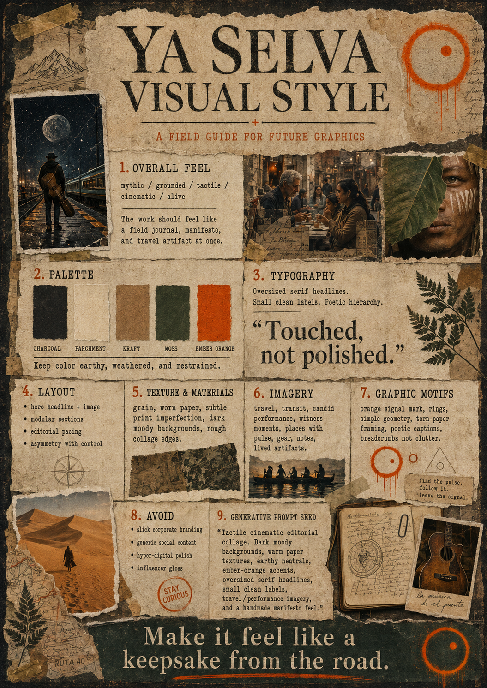

# Ya Selva — Visual Style

## A field guide for future graphics

## 1. Overall feel

mythic / grounded / tactile / cinematic / alive

The work should feel like a field journal, manifesto, and travel artifact at once.

## 2. Palette

| swatch | name |
|---|---|
| ⬛ | Charcoal |
| ⬜ | Parchment |
| 🟫 | Kraft |
| 🟩 | Moss |
| 🟧 | Ember Orange |

Keep color earthy, weathered, and restrained.

## 3. Typography

Oversized serif headlines. Small clean labels. Poetic hierarchy.

> "Touched, not polished."

## 4. Layout

- hero headline + image
- modular sections
- editorial pacing
- asymmetry with control

## 5. Texture & materials

Grain, worn paper, subtle print imperfection, dark moody backgrounds, rough collage edges.

## 6. Imagery

Travel, transit, candid performance, witness moments, places with pulse, gear, notes, lived artifacts.

## 7. Graphic motifs

Orange signal mark, rings, simple geometry, torn-paper framing, poetic captions, breadcrumbs not clutter.

## 8. Avoid

- slick corporate branding
- generic social content
- hyper-digital polish
- influencer gloss

## 9. Generative prompt seed

> "Tactile cinematic editorial collage. Dark moody backgrounds, warm paper textures, earthy neutrals, ember-orange accents, oversized serif headlines, small clean labels, travel/performance imagery, and a handmade manifesto feel."

## The line

> **Make it feel like a keepsake from the road.**
