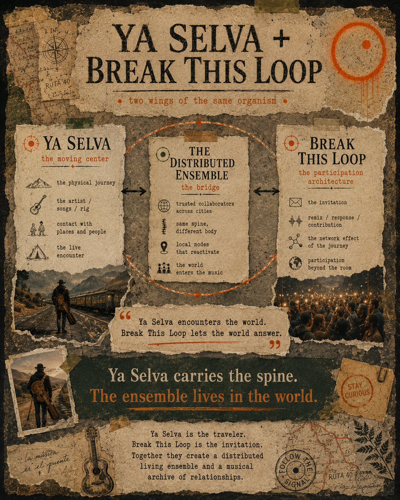

<!-- provenance: canonical (doc_type: canonical-visual-synthesis) — pulled from Parachute vault break-this-loop/ya-selva-and-break-this-loop-two-wings -->

# Ya Selva + Break This Loop — Two Wings of the Same Organism

## Companion note

This note explains the poster graphic below — a visual synthesis of how the two projects connect through the distributed ensemble.

> **Ya Selva encounters the world. Break This Loop lets the world answer.**

## The three panels

### Ya Selva — the moving center

- the physical journey
- the artist / songs / rig
- contact with places and people
- the live encounter

### The Distributed Ensemble — the bridge

- trusted collaborators across cities
- same spine, different body
- local nodes that reactivate
- the world enters the music

### Break This Loop — the participation architecture

- the invitation
- remix / response / contribution
- the network effect of the journey
- participation beyond the room

## The governing line

> **Ya Selva carries the spine. The ensemble lives in the world.**

## The closing synthesis

> Ya Selva is the traveler.
> Break This Loop is the invitation.
> Together they create a distributed living ensemble and a musical archive of relationships.

## Why this is a distinct note from the master connection note

[`the-connection.md`](the-connection.md) (vault: `break-this-loop/000-ya-selva-btl-connection`) is the canonical master note on how the two projects relate (presence-dependent vs. presence-independent, the collect/sing/open loop, Graceland as template, the stems question).

This note is narrower and newer: it names **the distributed ensemble specifically as the bridge mechanism** between the two — the thing that turns Ya Selva's solo travel into Break This Loop's participation architecture, city by city. It did not exist as a concept when the master connection note was written.

See: [`../live/the-distributed-ensemble.md`](../../live/the-distributed-ensemble.md)

## Related

- [`../live/the-distributed-ensemble.md`](../../live/the-distributed-ensemble.md) — canonical performance / touring architecture
- [`the-connection.md`](the-connection.md) — the master connection note (presence-dependent vs. presence-independent)
- [`../vision/vision.md`](../../vision/vision.md) — canonical vision
