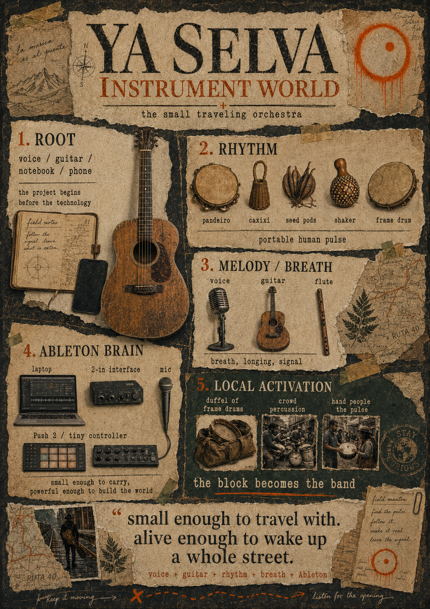

# Ya Selva — Instrument World

## The small traveling orchestra

## 1. Root

voice / guitar / notebook / phone

The project begins before the technology.

## 2. Rhythm

pandeiro, caxixi, seed pods, shaker, frame drum

Portable human pulse.

## 3. Melody / breath

voice, guitar, flute

Breath, longing, signal.

## 4. Ableton brain

- laptop
- 2-in interface
- mic
- Push 2 / tiny controller

Small enough to carry, powerful enough to build the world.

## 5. Local activation

- duffel of frame drums
- crowd percussion
- hand people the pulse

**The block becomes the band.**

## Field mantra

> Find the pulse. Follow it. Make it real. Leave the signal.

## The line

> "Small enough to travel with. Alive enough to wake up a whole street."

voice + guitar + rhythm + breath + Ableton
